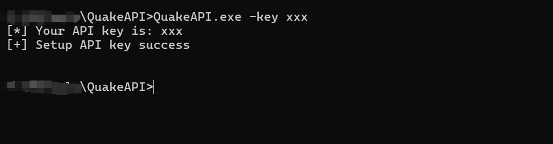
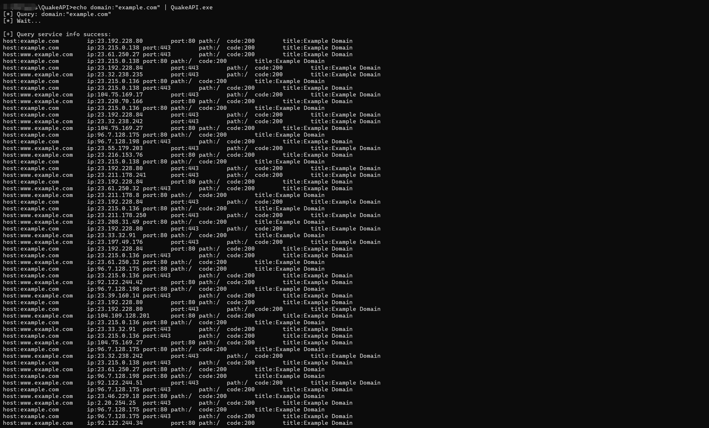

# 360网络空间测绘系统（Quake）API

- https://quake.360.cn/
- Quake是与Fofa、Shodan类似的搜索引擎，功能更强大
- 直接生成可执行文件，无需安装各种复杂的环境（Python，JDK等等）
- 使用高并发技术，获取大量数据时的效率提升
- 代码相对完善，考虑到后续拓展性


## 参数说明

- --help：查看帮助
- --key：设置你的API Key
- --search：输入你的查询字符串
- --output：设置输出文件（默认是result.txt）
- --total：查询总条数（默认是100条，如果数量较多，自动使用协程）
- --userinfo：否查询用户相关的信息

---


## 快速使用：

#### 初始化，设置api key

```
QuakeAPI.exe -key xxx
```



#### 查询

```
echo domain:"example.com" | QuakeAPI.exe
```


